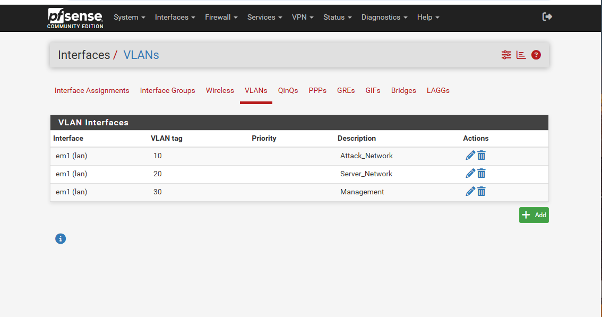
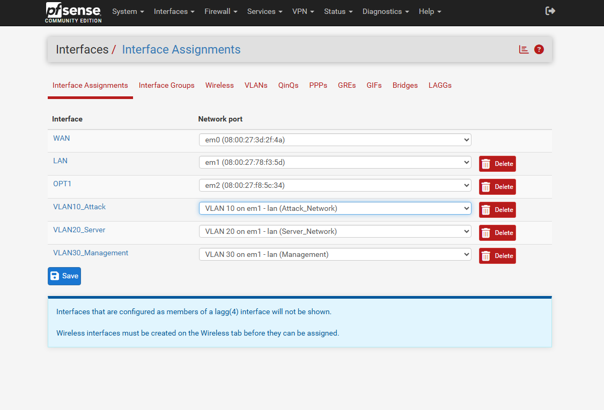
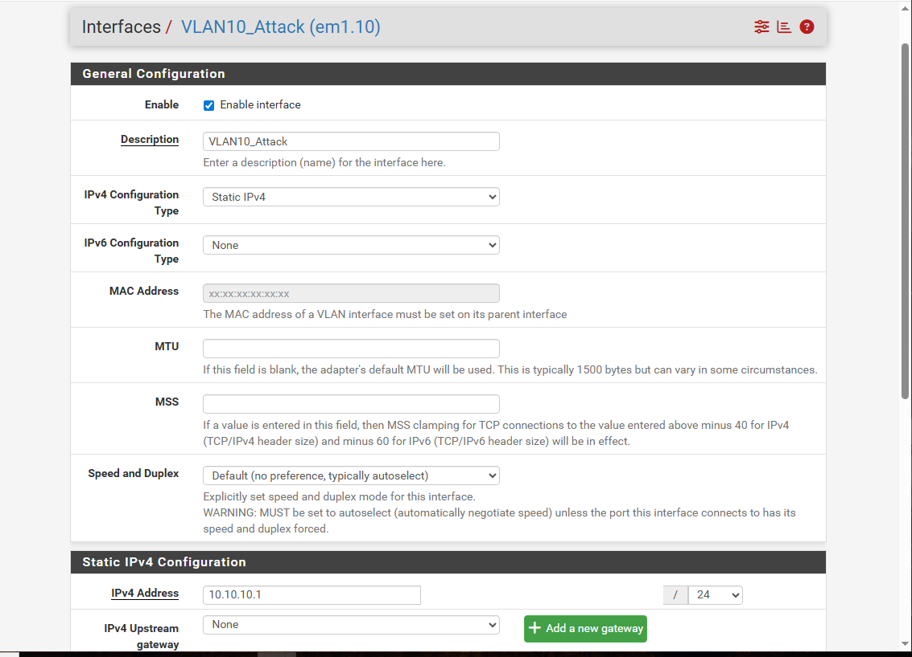
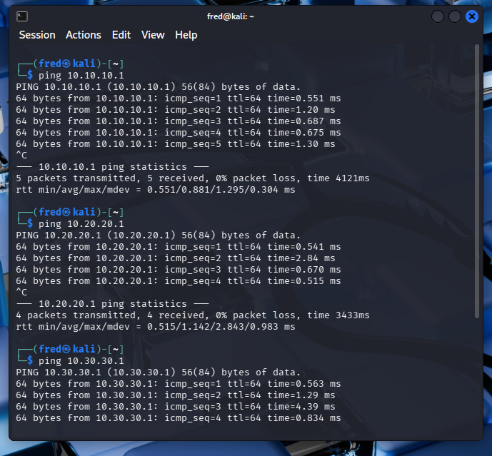

# pfSense VLAN Configuration
### Implementing Network Segmentation Using Virtual LANs in a Homelab Environment

---

## 🎯 What This Project Is About

This project implements real VLAN-based network segmentation in pfSense. Instead of having all VMs on one flat network, we create three isolated virtual networks, each with its own subnet, gateway and security boundary.

This mirrors how enterprise networks are designed to contain attacks, limit lateral movement and enforce least privilege at the network level.

Attack scenario: Flat network allows unrestricted lateral movement between all devices

Solution: VLAN segmentation isolates each network zone, attack machine cannot directly reach servers

Tools: pfSense, VirtualBox, Kali Linux

---

## Understanding the Problem

### What is a Flat Network?

A flat network has all devices on the same subnet with no separation between them.

My homelab before VLANs:

192.168.10.0/24 - Everyone on same network
Kali Linux - 192.168.10.102
Windows VM - 192.168.10.100
Ubuntu Server - 192.168.20.101

Problem with flat networks:
If Kali Linux is compromised, attacker has direct access to every other device with no barriers. This is called unrestricted lateral movement.

### How VLANs Solve This

VLANs create isolated Layer 2 segments. Devices in different VLANs cannot communicate directly, all traffic must pass through pfSense.

pfSense then enforces firewall rules on every inter-VLAN connection, giving complete control over what can talk to what.

### VLANs vs Subnetting

| | Subnetting | VLAN |
|---|---|---|
| OSI Layer | Layer 3 | Layer 2 |
| Enforced by | Router | Switch/pfSense |
| Stops direct Layer 2 traffic | No | Yes |
| Used together | Yes | Yes |

Subnetting organises IP addresses.
VLANs provide physical traffic isolation.
Both are needed for proper segmentation.

---

## 🎯 MITRE ATT&CK Mapping

| Field | Details |
|---|---|
| Tactic | Lateral Movement (TA0008) |
| Technique | Internal Spearphishing (T1534) |
| Defensive technique | Network Segmentation (M1030) |

### What This Means

VLAN segmentation directly mitigates lateral movement attacks. MITRE ATT&CK lists Network Segmentation (M1030) as a primary mitigation against techniques including:
- Remote Services (T1021) — SSH, RDP
- Lateral Tool Transfer (T1570)
- Internal Spearphishing (T1534)

By isolating Kali Linux in its own VLAN an attacker who compromises that machine cannot directly reach the server network without being intercepted by pfSense firewall rules.

---

## 🛠️ Prerequisites

### Homelab Environment
| Component | IP Address | Role |
|---|---|---|
| pfSense LAN | 192.168.10.1 | Firewall and router |
| pfSense OPT1 | 192.168.20.1 | Ubuntu server gateway |
| Kali Linux | 192.168.10.102 | Attack platform |
| Ubuntu Server | 192.168.20.101 | Target server |
| Windows VM | 192.168.10.100 | Management machine |

### Required Access
- pfSense web interface at http://192.168.10.1
- Admin credentials for pfSense
- Basic understanding of VLANs and subnetting

### Required Knowledge
- What VLANs are and why they matter
- Difference between tagged and untagged ports
- Basic IP addressing and subnetting

---

## Architecture

### VLAN Design

| VLAN | Interface | Subnet | Gateway | Purpose |
|---|---|---|---|---|
| VLAN 10 | em1.10 | 10.10.10.0/24 | 10.10.10.1 | Attack Network — Kali |
| VLAN 20 | em1.20 | 10.20.20.0/24 | 10.20.20.1 | Server Network — Ubuntu |
| VLAN 30 | em1.30 | 10.30.30.0/24 | 10.30.30.1 | Management — Windows |

### Why These Subnets?

The subnet matches the VLAN ID for clarity:
VLAN 10 → 10.10.10.0/24
VLAN 20 → 10.20.20.0/24
VLAN 30 → 10.30.30.0/24

This is a professional standard convention to make it easy to remember and immediately readable in firewall logs and network diagrams.

### Traffic Flow

Kali Linux (VLAN 10) tries to reach Ubuntu (VLAN 20):
Step 1 - Kali sends packet to 10.20.20.x
Step 2 - Traffic hits VLAN 10 gateway 10.10.10.1
Step 3 - pfSense evaluates inter-VLAN firewall rules
Step 4 - Rule allows or blocks based on policy
Step 5 - If allowed — routes to VLAN 20 gateway
Step 6 - Ubuntu receives packet

Without VLANs, step 3 and 4 don't exist.
With VLANs, pfSense controls everything.

---

## 📁 Project Files

| File | Purpose |
|---|---|
| screenshots/ | Evidence of configuration and testing |
| README.md | Full documentation and replication guide |

---

## 🔬 Step by Step — How to Replicate

### Step 1 — Access pfSense

Open browser and navigate to:
http://192.168.10.1

Login with admin credentials.

---

### Step 2 — Create VLANs

Navigate to Interfaces → VLANs → Add

#### VLAN 10 — Attack Network

Parent Interface: em1 (lan)
VLAN Tag: 10
Description: Attack_Network

Click Save.

#### VLAN 20 — Server Network
Click Add again:

Parent Interface: em1 (lan)
VLAN Tag: 20
Description: Server_Network

Click Save.

#### VLAN 30 — Management
Click Add again:

Parent Interface: em1 (lan)
VLAN Tag: 30
Description: Management

Click Save.

Why em1 (lan) as parent?
VLANs must be created on LAN interface, never on WAN. WAN faces the internet and VLAN tags on WAN would expose internal network structure externally.

Expected result:
Three VLANs listed:
em1 (lan) — VLAN tag 10 — Attack_Network
em1 (lan) — VLAN tag 20 — Server_Network
em1 (lan) — VLAN tag 30 — Management

---

### Step 3 — Assign VLAN Interfaces

Navigate to Interfaces → Interface Assignments

You will see available interfaces including:
em1.10, em1.20, em1.30

Click Add for each one to assign them
as new interfaces (OPT2, OPT3, OPT4).

---

### Step 4 — Configure Each VLAN Interface

Click on each newly assigned interface and
configure as follows:

#### VLAN10_Attack (em1.10)

Enable: checked
Description: VLAN10_Attack
IPv4 Configuration Type: Static IPv4
IPv4 Address: 10.10.10.1/24
Upstream Gateway: None

Click Save then Apply Changes.

#### VLAN20_Server (em1.20)

Enable: checked
Description: VLAN20_Server
IPv4 Configuration Type: Static IPv4
IPv4 Address: 10.20.20.1/24
Upstream Gateway: None

Click Save then Apply Changes.

#### VLAN30_Management (em1.30)

Enable: checked
Description: VLAN30_Management
IPv4 Configuration Type: Static IPv4
IPv4 Address: 10.30.30.1/24
Upstream Gateway: None

Click Save then Apply Changes.

Important — Why not use 192.168.x.x?
The existing LAN uses 192.168.10.0/24 and
OPT1 uses 192.168.20.0/24. VLAN subnets
must not overlap with existing interfaces.
Using 10.x.x.x avoids all conflicts.

---

### Step 5 — Verify VLAN Connectivity

On Kali Linux open terminal and test
connectivity to each VLAN gateway:

Test VLAN 10:
ping 10.10.10.1

Expected result:
64 bytes from 10.10.10.1 — replies confirmed

Test VLAN 20:
ping 10.20.20.1

Test VLAN 30:
ping 10.30.30.1

Successful ping to each gateway confirms:
- VLAN interface is active on pfSense
- pfSense is routing traffic correctly
- VLAN segmentation is operational

---

## 📊 Results and Screenshots

### VLAN List — All 3 Created

What to look for:
Three entries all on em1 (lan)
VLAN tags 10, 20 and 30
Descriptions Attack_Network, Server_Network,
Management

---

### Interface Assignments

What to look for:
VLAN interfaces assigned as OPT2, OPT3, OPT4
Each showing correct em1.10, em1.20, em1.30

---

### VLAN10 Interface Configuration

What to look for:
Interface name: VLAN10_Attack (em1.10)
Enable: checked
IPv4 Address: 10.10.10.1/24
Static IPv4 confirmed

---

### Ping Test — VLAN Gateway Reachable

What to look for:
64 bytes from 10.10.10.1 — replies
0% packet loss
Confirms VLAN routing is working

---

## 🔍 Indicators of Compromise (IOCs)

VLANs help detect these lateral movement IOCs:

| IOC | Without VLANs | With VLANs |
|---|---|---|
| Unexpected cross-network traffic | Hard to detect | Immediately visible in pfSense logs |
| Attacker pivoting between zones | Unrestricted | Blocked by inter-VLAN rules |
| Reconnaissance scanning | Reaches all devices | Contained to one VLAN |
| Malware spreading laterally | No barriers | Must pass through pfSense |

### Security Zones Created

| Zone | VLAN | Trust Level | Access Policy |
|---|---|---|---|
| Attack Network | VLAN 10 | Untrusted | No access to other VLANs |
| Server Network | VLAN 20 | Trusted | Restricted inbound only |
| Management | VLAN 30 | Highly trusted | Admin access only |

---

## Understanding the Results

### What VLAN Segmentation Achieves

Before VLANs — flat network:
Any device can reach any other device directly
Compromising Kali = access to everything
No visibility into lateral movement attempts

After VLANs — segmented network:
Each zone is isolated at Layer 2
All inter-zone traffic goes through pfSense
Every connection attempt is logged
Firewall rules control exactly what can talk
to what — per VLAN

### VirtualBox Limitation

In a VirtualBox homelab without a managed
physical switch, VMs cannot automatically
join VLAN subnets by plugging in. The VLANs
exist on pfSense and gateways are reachable
but VMs need manual network reconfiguration
to fully operate within each VLAN.

In a real enterprise environment with managed
switches, each physical port would be assigned
to a VLAN and devices would automatically
receive IPs from the correct VLAN subnet
via DHCP.

### What a SOC Analyst Does With This

After implementing VLANs:
1. Configure DHCP per VLAN so devices get
   correct IPs automatically
2. Write inter-VLAN firewall rules in pfSense
   controlling exactly what can cross zones
3. Monitor pfSense logs for unexpected
   cross-VLAN traffic — potential lateral movement
4. Send VLAN-specific logs to Splunk for
   real-time detection and alerting

---

## 💡 Key Learnings

| Concept | What I Learned |
|---|---|
| VLAN creation | Created on LAN parent interface — never WAN |
| VLAN IDs | Tag identifies which virtual network a packet belongs to |
| Subnet assignment | Each VLAN needs unique non-overlapping subnet |
| Gateway per VLAN | pfSense acts as gateway for every VLAN |
| Inter-VLAN routing | All cross-VLAN traffic controlled by pfSense |
| VirtualBox limitation | Physical managed switch needed for full VLAN operation |
| Naming convention | VLAN ID matches subnet for readability |
| Security zones | Separate trust levels per VLAN |

---

## 🔗 References and Further Reading

- pfSense VLAN documentation:
  docs.netgate.com/pfsense/en/latest/vlan
- MITRE ATT&CK Network Segmentation:
  attack.mitre.org/mitigations/M1030
- MITRE ATT&CK Lateral Movement:
  attack.mitre.org/tactics/TA0008
- 802.1Q VLAN standard:
  ieee802.org/1/pages/802.1Q.html

---

## 🔗 Related Projects
- [pfSense Firewall Configuration](https://github.com/Phredreeq/pfsense-firewall-configuration)
- [pfSense Firewall Deep Dive](https://github.com/Phredreeq/pfsense-firewall-deep-dive)
- [pfSense Real-Time Log Forwarding](https://github.com/Phredreeq/pfsense-splunk-log-forwarding)
- [VLAN and Network Segmentation Concepts](https://github.com/Phredreeq/vlan-network-segmentation-concepts)

---

## 👤 Author
Fredrick Agufenwa

Cybersecurity Student | SOC Analyst in Training
